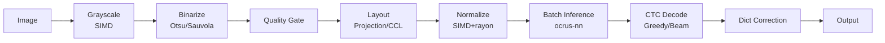

<p align="center">
  
</p>

<h1 align="center">ocrus</h1>

<p align="center">
  Lightning-fast Japanese OCR written in Rust<br/>
  <sub>ocrus = a play on oculus (👁️ eye) &amp; <b>OCR</b> us</sub>
</p>

<p align="center">
  <a href="https://github.com/owayo/ocrus/actions/workflows/ci.yml">
    
  </a>
  <a href="LICENSE">
    
  </a>
  <a href="README.md">日本語</a>
</p>

---

## Features

- SIMD-accelerated preprocessing (grayscale, binarize, normalize, projection)
- Adaptive binarization (Otsu + Sauvola fallback)
- Automatic image quality assessment for adaptive pipeline
- Layout analysis: projection, connected component labeling, vertical text detection
- Ruby (furigana) separation via CCL-based size heuristic
- Cascade recognition: character segmentation → classifier → CTC fallback
- Custom inference engine (`ocrus-nn`): pure Rust, no ONNX Runtime dependency
- `.ocnn` binary model format (mmap-friendly, Conv+BN+ReLU fusion)
- CTC decode: greedy + beam search fallback for low-confidence lines
- JIS X 0208 charset logit masking
- Aho-Corasick dictionary post-correction
- Zero-copy I/O via memory-mapped files
- Parallel line normalization with rayon
- Glyph cache with perceptual hashing
- JSON and plain text output
- Training data generation with font style filtering (Rust, rayon-parallel)
- Fine-tuning support (PP-OCRv5, PaddleOCR)
- Interactive TUI for operations management

## Requirements

- Rust 2024 edition (1.85+)

## Installation

```bash
cargo install --path crates/ocrus-cli
```

## Quickstart

```bash
# Download models
./models/download.sh

# Recognize text from an image
ocrus recognize image.png

# JSON output
ocrus recognize image.png --format json

# Launch interactive TUI
ocrus tui
```

## Usage

### Recognition

```bash
# Basic recognition
ocrus recognize image.png

# JIS X 0208 charset (fewer false positives for Japanese)
ocrus recognize image.png --charset jis

# Dictionary-based post-correction
ocrus recognize image.png --dict corrections.txt

# Fastest mode (skip quality gate, batch inference)
ocrus recognize image.png --mode fastest

# Accurate mode (full quality pipeline)
ocrus recognize image.png --mode accurate

# Ruby (furigana) separation
ocrus recognize image.png --ruby

# Cascade recognition (requires cascade classifier model)
ocrus recognize image.png --cascade path/to/cascade_model.ocnn
```

### Interactive TUI

```bash
ocrus tui
```

Provides a terminal UI menu for common operations:

- E2E Accuracy Test
- Download Models
- ONNX → .ocnn Convert
- Dataset Generate
- Fine-tune
- Export ONNX
- Quantize (INT8)
- Benchmark

### Benchmarks

```bash
ocrus bench image.png -n 100
```

### Training Data Generation

```bash
# Generate training data from system fonts
ocrus dataset generate --output ./training_data --categories hiragana,katakana

# Filter by font style
ocrus dataset generate --output ./training_data \
  --categories hiragana,katakana --font-styles mincho,gothic

# Generate from test failure results
ocrus dataset from-failures --failures ./failures.json --output ./training_data
```

## Model Setup

Download OCR models and convert to `.ocnn` format:

```bash
./models/download.sh
```

Models are installed to `~/.ocrus/models/` by default. Override with `OCRUS_MODEL_DIR`.

- `rec.ocnn` — PP-OCRv5 recognition model (pure Rust inference, no ONNX Runtime)
- `dict.txt` — Character dictionary (18,383 chars)

To convert an ONNX model to `.ocnn` format:

```bash
uv run --project scripts python scripts/src/ocrus_scripts/convert_to_ocnn.py rec.onnx -o ~/.ocrus/models/rec.ocnn
```

### `.ocnn` Format

`.ocnn` (**Oc**rus **N**eural **N**etwork) is a custom binary model format designed for ocrus's pure Rust inference engine (`ocrus-nn`). It eliminates the dependency on ONNX Runtime while enabling zero-copy model loading via `mmap`.

Key characteristics:
- **mmap-friendly**: Models are loaded directly from disk without parsing overhead
- **Conv+BN+ReLU fusion**: Batch normalization is fused into convolution weights at conversion time
- **Fixed-size layer descriptors**: Efficient random access to layer metadata
- **DAG execution graph**: Supports transformer architectures with residual connections and multi-head attention (v2)
- **Constant table**: Embedded constant tensors for dynamic shapes and graph parameters

## Architecture



### Crates

| Crate | Role |
|-------|------|
| `ocrus-core` | Data models, config, errors, EngineConfig API |
| `ocrus-preproc` | Image preprocessing (SIMD grayscale, Otsu/Sauvola binarize, normalize) |
| `ocrus-layout` | Layout analysis (projection, CCL, vertical, quality gate, ruby separation) |
| `ocrus-recognizer` | CTC recognition (greedy + beam search, JIS charset, dict correction, cascade) |
| `ocrus-nn` | Pure Rust inference engine (.ocnn format, SIMD ops, mmap model loading) |
| `ocrus-cli` | CLI entry point |
| `ocrus-dataset` | Training data generation (font rendering, augmentation, font style filtering) |

## Fine-tuning

Fine-tune the PP-OCRv5 recognition model to improve accuracy on specific characters.
The pipeline consists of 4 steps: data generation (Rust) → training (Python/PaddleOCR) → ONNX export → model replacement.

> **Note**: Training requires **Python 3.12** (PaddlePaddle 3.3 does not support 3.13+). The `scripts/` directory uses [uv](https://docs.astral.sh/uv/) for Python environment management.

### Prerequisites

```bash
# Clone PaddleOCR (training scripts)
git clone https://github.com/PaddlePaddle/PaddleOCR.git /tmp/PaddleOCR

# Install Python training dependencies
uv sync --project scripts --extra train
```

### Step 1: Generate Training Data

`ocrus-dataset` crate renders text images from system fonts with augmentation (rotation, blur, noise, contrast). Data generation runs in Rust with rayon parallelism.

```bash
# Generate training data for target character categories
ocrus dataset generate \
  --output /tmp/ocrus_training_data \
  --categories hiragana,katakana,halfwidth_alnum,fullwidth_alnum \
  --samples-per-char 5

# Or generate focused data from test failure results
ocrus dataset from-failures \
  --failures ./test_results/failures.json \
  --output /tmp/ocrus_training_data \
  --samples 10
```

Available character categories:

| Category | Content | Count |
|----------|---------|-------|
| `halfwidth_alnum` | Half-width alphanumeric (A-Z, a-z, 0-9) | 62 |
| `halfwidth_symbols` | Half-width symbols (!@#$%&... etc.) | 32 |
| `fullwidth_alnum` | Full-width alphanumeric | 62 |
| `fullwidth_symbols` | Full-width symbols, Japanese punctuation | 63 |
| `hiragana` | Hiragana | 83 |
| `katakana` | Katakana | 86 |
| `joyo_kanji` | Joyo kanji (2010 revision) | 2,136 |
| `jis_level1` | JIS X 0208 Level 1 kanji | 2,965 |
| `jis_level2` | JIS X 0208 Level 2 kanji | 3,390 |
| `jis_level3` | JIS X 0213 Level 3 kanji | 1,233 |
| `jis_level4` | JIS X 0213 Level 4 kanji | 7,960 |

Available font styles (for `--font-styles`):

| Style | Description | Match patterns |
|-------|-------------|----------------|
| `mincho` | Mincho / Serif | mincho, serif, song, batang |
| `gothic` | Gothic / Sans-serif | gothic, sans, kaku, maru |
| `script` | Script / Brush | script, brush, gyosho, kaisho |
| `monospace` | Monospace | mono, courier, consolas, menlo |
| `other` | Unclassified | (default) |

Output format:
```
/tmp/ocrus_training_data/
  manifest.json      # Metadata (fonts, categories, augment config)
  labels.tsv         # filename \t ground_truth \t category \t font \t augment
  train_list.txt     # PaddleOCR format (image_path \t label)
  val_list.txt
  samples/           # Rendered PNG images (height 48px)
    000000.png
    000001.png
    ...
```

### Step 2: Download Pretrained Weights

```bash
# Download PP-OCRv5 server rec pretrained weights (~214MB)
mkdir -p models/pretrained
curl -L -o models/pretrained/PP-OCRv5_server_rec_pretrained.pdparams \
  https://paddle-model-ecology.bj.bcebos.com/paddlex/official_pretrained_model/PP-OCRv5_server_rec_pretrained.pdparams
```

### Step 3: Fine-tune with PaddleOCR

#### CPU vs GPU

| | CPU | GPU (e.g. RTX 4060 Super) |
|---|---|---|
| PaddlePaddle | `paddlepaddle==3.3.0` | `paddlepaddle-gpu==3.3.0` |
| Config: `use_gpu` | `false` | `true` |
| Config: `batch_size_per_card` | 32 | 128 |
| Config: `num_workers` | 0 | 4-8 |
| Speed | ~18s/batch | ~0.4s/batch |
| 5 epochs (276k images) | ~8 days | ~4 hours |

```bash
# CPU only (default)
uv sync --project scripts --extra train

# GPU (CUDA)
uv sync --project scripts --extra train-gpu
```

#### Training Config

Create a YAML config file (based on `PP-OCRv5_server_rec.yml`). Below is a CPU example — for GPU, change `use_gpu`, `batch_size_per_card`, and `num_workers` as shown above.

```yaml
Global:
  model_name: PP-OCRv5_server_rec
  use_gpu: false
  epoch_num: 5
  save_model_dir: /tmp/ocrus_finetune_output
  pretrained_model: ./models/pretrained/PP-OCRv5_server_rec_pretrained
  character_dict_path: /tmp/PaddleOCR/ppocr/utils/dict/ppocrv5_dict.txt
  max_text_length: &max_text_length 25
  eval_batch_step: [500, 1000]

Optimizer:
  name: Adam
  lr:
    name: Cosine
    learning_rate: 0.0001
    warmup_epoch: 1

Train:
  dataset:
    name: SimpleDataSet
    data_dir: /tmp/ocrus_training_data/
    label_file_list:
    - /tmp/ocrus_training_data/train_list.txt
  loader:
    batch_size_per_card: 32
    num_workers: 0
```

See the full config reference at `PaddleOCR/configs/rec/PP-OCRv5/PP-OCRv5_server_rec.yml`.

#### Run Training

```bash
PYTHONPATH=/tmp/PaddleOCR:$PYTHONPATH \
  uv run --project scripts --python 3.12 python3 -u /tmp/PaddleOCR/tools/train.py \
  -c /path/to/your_config.yml
```

Training outputs:
```
/tmp/ocrus_finetune_output/
  train.log              # Training log
  config.yml             # Saved config
  best_accuracy/         # Best model checkpoint
    best_accuracy.pdparams
  latest/                # Latest checkpoint (for resume)
```

To resume from a checkpoint, add to config:
```yaml
Global:
  checkpoints: /tmp/ocrus_finetune_output/latest
```

### Step 4: Export to ONNX

```bash
# Export best model to ONNX
uv run --project scripts export-onnx \
  --model /tmp/ocrus_finetune_output/best_accuracy \
  --output rec_finetuned.onnx

# Install as the default model
uv run --project scripts export-onnx \
  --model /tmp/ocrus_finetune_output/best_accuracy \
  --output rec_finetuned.onnx \
  --install   # Copies to ~/.ocrus/models/rec.onnx

# Convert to .ocnn format
uv run --project scripts python scripts/src/ocrus_scripts/convert_to_ocnn.py \
  rec_finetuned.onnx -o ~/.ocrus/models/rec.ocnn
```

### Step 5 (Optional): INT8 Quantization

```bash
uv sync --project scripts --extra quantize

uv run --project scripts quantize \
  --input rec_finetuned.onnx \
  --output rec_int8.onnx
```

### Accuracy Testing

Run character accuracy tests to evaluate the model and identify weak characters.
Tests are split into steps so you can iterate incrementally:

| Step | Target | Char count |
|------|--------|------------|
| `step1` | Half/full-width alphanumeric & symbols | ~220 |
| `step2` | Hiragana & Katakana | ~170 |
| `step3_joyo` | Joyo kanji | 2,136 |
| `step3_jis1` | JIS Level 1 kanji | 2,965 |
| `step3_jis2` | JIS Level 2 kanji | 3,390 |
| `step3_jis3` | JIS Level 3 kanji | 1,233 |
| `step3_jis4` | JIS Level 4 kanji | 7,960 |

```bash
# Step 1: Half/full-width alphanumeric & symbols (a few minutes)
cargo test -p ocrus-cli --test char_accuracy char_accuracy_step1 -- --ignored --nocapture

# Step 2: Hiragana & Katakana
cargo test -p ocrus-cli --test char_accuracy char_accuracy_step2 -- --ignored --nocapture

# Step 3: Kanji (run each level separately)
cargo test -p ocrus-cli --test char_accuracy char_accuracy_step3_joyo -- --ignored --nocapture
cargo test -p ocrus-cli --test char_accuracy char_accuracy_step3_jis1 -- --ignored --nocapture
cargo test -p ocrus-cli --test char_accuracy char_accuracy_step3_jis2 -- --ignored --nocapture
cargo test -p ocrus-cli --test char_accuracy char_accuracy_step3_jis3 -- --ignored --nocapture
cargo test -p ocrus-cli --test char_accuracy char_accuracy_step3_jis4 -- --ignored --nocapture

# All steps at once
cargo test -p ocrus-cli --test char_accuracy char_accuracy_all -- --ignored --nocapture

# A/B test against a quantized model (combinable with any step)
OCRUS_QUANTIZED_MODEL=rec_int8.onnx \
  cargo test -p ocrus-cli --test char_accuracy char_accuracy_step1 -- --ignored --nocapture
```

Test results are exported to:
- `logs/char_accuracy_{step}_{timestamp}.log` — Full test log (accuracy per font/category, speed, ETA)
- `test_results/failures_{step}.json` — Failed characters (can be fed back into Step 1 `from-failures` for targeted retraining)

Failures are saved incrementally after each category completes. If interrupted with Ctrl+C, results up to that point are also saved.

## Development

```bash
cargo build          # Build all crates
cargo test           # Run all tests
cargo clippy         # Lint
cargo fmt            # Format
cargo bench          # Benchmarks
```

## License

[MIT](LICENSE)
