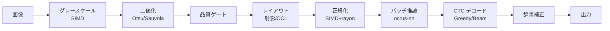

<p align="center">
  
</p>

<h1 align="center">ocrus</h1>

<p align="center">
  Pure Rust で完結する超高速日本語 OCR<br/>
  <sub>ocrus = oculus（👁️ 目）の当て字 &amp; <b>OCR</b> us</sub>
</p>

<p align="center">
  <a href="https://github.com/owayo/ocrus/actions/workflows/ci.yml">
    
  </a>
  <a href="LICENSE">
    
  </a>
  <a href="README.en.md">English</a>
</p>

---

## 特徴

- SIMD 高速前処理（グレースケール、二値化、正規化、射影）
- 適応的二値化（Otsu + Sauvola フォールバック）
- 画像品質の自動評価によるパイプライン適応
- レイアウト解析：射影、連結成分ラベリング（CCL）、縦書き検出
- ルビ（ふりがな）分離：CCL ベースのサイズヒューリスティック
- カスケード認識：文字セグメンテーション → 分類器 → CTC フォールバック
- 自作推論エンジン `ocrus-nn`：純 Rust、ONNX Runtime 依存ゼロ
- `.ocnn` バイナリモデルフォーマット（mmap 対応、Conv+BN+ReLU 融合）
- CTC デコード：Greedy + 低信頼行への Beam Search フォールバック
- JIS X 0208 文字セットによる logit マスキング
- Aho-Corasick 辞書による後処理補正
- メモリマップドファイルによるゼロコピー I/O
- rayon による並列行正規化
- パーセプチュアルハッシュによるグリフキャッシュ
- JSON / プレーンテキスト出力
- フォントスタイルフィルタ付き訓練データ生成（Rust、rayon 並列）
- ファインチューニング対応（PP-OCRv5, PaddleOCR）
- 対話型 TUI による操作管理

## 必要環境

- Rust 2024 edition (1.85+)

## インストール

```bash
cargo install --path crates/ocrus-cli
```

## クイックスタート

```bash
# モデルのダウンロード
./models/download.sh

# 画像からテキスト認識
ocrus recognize image.png

# JSON 出力
ocrus recognize image.png --format json

# 対話型 TUI を起動
ocrus tui
```

## 使い方

### 文字認識

```bash
# 基本的な認識
ocrus recognize image.png

# JIS X 0208 文字セット（日本語の誤認識を低減）
ocrus recognize image.png --charset jis

# 辞書による後処理補正
ocrus recognize image.png --dict corrections.txt

# 最速モード（品質ゲートをスキップ、バッチ推論）
ocrus recognize image.png --mode fastest

# 高精度モード（フル品質パイプライン）
ocrus recognize image.png --mode accurate

# ルビ（ふりがな）分離
ocrus recognize image.png --ruby

# カスケード認識（カスケード分類器モデルが必要）
ocrus recognize image.png --cascade path/to/cascade_model.ocnn
```

### 対話型 TUI

```bash
ocrus tui
```

ターミナル UI メニューから以下の操作を実行できます：

- E2E 精度テスト
- モデルダウンロード
- ONNX → .ocnn 変換
- データセット生成
- ファインチューン
- ONNX エクスポート
- INT8 量子化
- ベンチマーク

操作方法：`j`/`k` または上下キーで移動、`Enter` で実行、`q` で終了

### ベンチマーク

```bash
ocrus bench image.png -n 100
```

### 訓練データ生成

```bash
# システムフォントから訓練データを生成
ocrus dataset generate --output ./training_data --categories hiragana,katakana

# フォントスタイルでフィルタ
ocrus dataset generate --output ./training_data \
  --categories hiragana,katakana --font-styles mincho,gothic

# テスト失敗結果から生成
ocrus dataset from-failures --failures ./failures.json --output ./training_data
```

## モデルのセットアップ

OCR モデルをダウンロードして `.ocnn` フォーマットに変換します：

```bash
./models/download.sh
```

デフォルトでは `~/.ocrus/models/` にインストールされます。`OCRUS_MODEL_DIR` 環境変数で変更可能です。

- `rec.ocnn` — PP-OCRv5 認識モデル（純 Rust 推論、ONNX Runtime 不要）
- `dict.txt` — 文字辞書（18,383 文字）

ONNX モデルを `.ocnn` フォーマットに変換するには：

```bash
uv run --project scripts python scripts/src/ocrus_scripts/convert_to_ocnn.py rec.onnx -o ~/.ocrus/models/rec.ocnn
```

### `.ocnn` フォーマット

`.ocnn`（**Oc**rus **N**eural **N**etwork）は ocrus の純 Rust 推論エンジン（`ocrus-nn`）向けに設計されたカスタムバイナリモデルフォーマットです。ONNX Runtime への依存を排除しつつ、`mmap` によるゼロコピーモデルロードを実現します。

主な特徴：
- **mmap 対応**：パース不要でディスクから直接ロード
- **Conv+BN+ReLU 融合**：変換時にバッチ正規化を畳み込みに融合
- **固定サイズレイヤー記述子**：メタデータへの効率的なランダムアクセス
- **DAG 実行グラフ**：残差接続やマルチヘッドアテンションを持つ Transformer アーキテクチャ対応（v2）
- **定数テーブル**：動的シェイプやグラフパラメータ用の埋め込み定数テンソル

## アーキテクチャ



### クレート構成

| クレート | 役割 |
|----------|------|
| `ocrus-core` | データモデル、設定、エラー、EngineConfig API |
| `ocrus-preproc` | 画像前処理（SIMD グレースケール、Otsu/Sauvola 二値化、正規化） |
| `ocrus-layout` | レイアウト解析（射影、CCL、縦書き、品質ゲート、ルビ分離） |
| `ocrus-recognizer` | CTC 認識（Greedy + Beam Search、JIS 文字セット、辞書補正、カスケード） |
| `ocrus-nn` | 純 Rust 推論エンジン（.ocnn フォーマット、SIMD 演算、mmap モデルロード） |
| `ocrus-cli` | CLI エントリポイント |
| `ocrus-dataset` | 訓練データ生成（フォントレンダリング、オーグメンテーション、フォントスタイルフィルタ） |

## ファインチューニング

PP-OCRv5 認識モデルをファインチューニングして、特定の文字の精度を改善します。
パイプラインは4ステップで構成されます：データ生成（Rust）→ 訓練（Python/PaddleOCR）→ ONNX エクスポート → モデル差し替え

> **注意**: 訓練には **Python 3.12** が必要です（PaddlePaddle 3.3 は 3.13+ 非対応）。`scripts/` ディレクトリは [uv](https://docs.astral.sh/uv/) で Python 環境を管理しています。

### 前提条件

```bash
# PaddleOCR をクローン（訓練スクリプト用）
git clone https://github.com/PaddlePaddle/PaddleOCR.git /tmp/PaddleOCR

# Python 訓練依存パッケージをインストール
uv sync --project scripts --extra train
```

### ステップ 1: 訓練データの生成

`ocrus-dataset` クレートがシステムフォントからテキスト画像をレンダリングし、オーグメンテーション（回転、ぼかし、ノイズ、コントラスト）を適用します。データ生成は Rust + rayon 並列で実行されます。

```bash
# 対象文字カテゴリの訓練データを生成
ocrus dataset generate \
  --output /tmp/ocrus_training_data \
  --categories hiragana,katakana,halfwidth_alnum,fullwidth_alnum \
  --samples-per-char 5

# テスト失敗結果から重点的にデータを生成
ocrus dataset from-failures \
  --failures ./test_results/failures.json \
  --output /tmp/ocrus_training_data \
  --samples 10
```

文字カテゴリ一覧：

| カテゴリ | 内容 | 文字数 |
|----------|------|--------|
| `halfwidth_alnum` | 半角英数字（A-Z, a-z, 0-9） | 62 |
| `halfwidth_symbols` | 半角記号（!@#$%&... 等） | 32 |
| `fullwidth_alnum` | 全角英数字（Ａ-Ｚ, ａ-ｚ, ０-９） | 62 |
| `fullwidth_symbols` | 全角記号・日本語句読点（、。「」…） | 63 |
| `hiragana` | ひらがな（あ-ん） | 83 |
| `katakana` | カタカナ（ア-ヶ） | 86 |
| `joyo_kanji` | 常用漢字（2010年改定） | 2,136 |
| `jis_level1` | JIS X 0208 第1水準漢字 | 2,965 |
| `jis_level2` | JIS X 0208 第2水準漢字 | 3,390 |
| `jis_level3` | JIS X 0213 第3水準漢字 | 1,233 |
| `jis_level4` | JIS X 0213 第4水準漢字 | 7,960 |

フォントスタイル（`--font-styles` オプション）：

| スタイル | 説明 | マッチパターン |
|----------|------|----------------|
| `mincho` | 明朝体 | mincho, 明朝, serif, song, batang |
| `gothic` | ゴシック体 | gothic, ゴシック, sans, kaku, maru |
| `script` | 筆書体 | script, brush, 筆, gyosho, kaisho |
| `monospace` | 等幅 | mono, courier, consolas, menlo |
| `other` | その他 | （デフォルト） |

出力フォーマット：
```
/tmp/ocrus_training_data/
  manifest.json      # メタデータ（フォント、カテゴリ、オーグメント設定）
  labels.tsv         # ファイル名 \t 正解 \t カテゴリ \t フォント \t オーグメント
  train_list.txt     # PaddleOCR 形式（画像パス \t ラベル）
  val_list.txt
  samples/           # レンダリング済み PNG 画像（高さ 48px）
    000000.png
    000001.png
    ...
```

### ステップ 2: 事前学習済み重みのダウンロード

```bash
# PP-OCRv5 server rec 事前学習済み重みをダウンロード（約214MB）
mkdir -p models/pretrained
curl -L -o models/pretrained/PP-OCRv5_server_rec_pretrained.pdparams \
  https://paddle-model-ecology.bj.bcebos.com/paddlex/official_pretrained_model/PP-OCRv5_server_rec_pretrained.pdparams
```

### ステップ 3: PaddleOCR でファインチューン

#### CPU vs GPU

| | CPU | GPU（例: RTX 4060 Super） |
|---|---|---|
| PaddlePaddle | `paddlepaddle==3.3.0` | `paddlepaddle-gpu==3.3.0` |
| 設定: `use_gpu` | `false` | `true` |
| 設定: `batch_size_per_card` | 32 | 128 |
| 設定: `num_workers` | 0 | 4-8 |
| 速度 | 約18秒/バッチ | 約0.4秒/バッチ |
| 5エポック（276k画像） | 約8日 | 約4時間 |

```bash
# CPU のみ（デフォルト）
uv sync --project scripts --extra train

# GPU（CUDA）
uv sync --project scripts --extra train-gpu
```

#### 訓練設定

YAML 設定ファイルを作成します（`PP-OCRv5_server_rec.yml` ベース）。以下は CPU の例です。GPU の場合は上記の表に従って `use_gpu`、`batch_size_per_card`、`num_workers` を変更してください。

```yaml
Global:
  model_name: PP-OCRv5_server_rec
  use_gpu: false
  epoch_num: 5
  save_model_dir: /tmp/ocrus_finetune_output
  pretrained_model: ./models/pretrained/PP-OCRv5_server_rec_pretrained
  character_dict_path: /tmp/PaddleOCR/ppocr/utils/dict/ppocrv5_dict.txt
  max_text_length: &max_text_length 25
  eval_batch_step: [500, 1000]

Optimizer:
  name: Adam
  lr:
    name: Cosine
    learning_rate: 0.0001
    warmup_epoch: 1

Train:
  dataset:
    name: SimpleDataSet
    data_dir: /tmp/ocrus_training_data/
    label_file_list:
    - /tmp/ocrus_training_data/train_list.txt
  loader:
    batch_size_per_card: 32
    num_workers: 0
```

完全な設定リファレンスは `PaddleOCR/configs/rec/PP-OCRv5/PP-OCRv5_server_rec.yml` を参照してください。

#### 訓練の実行

```bash
PYTHONPATH=/tmp/PaddleOCR:$PYTHONPATH \
  uv run --project scripts --python 3.12 python3 -u /tmp/PaddleOCR/tools/train.py \
  -c /path/to/your_config.yml
```

訓練出力：
```
/tmp/ocrus_finetune_output/
  train.log              # 訓練ログ
  config.yml             # 保存された設定
  best_accuracy/         # 最良モデルのチェックポイント
    best_accuracy.pdparams
  latest/                # 最新チェックポイント（再開用）
```

チェックポイントから再開するには、設定に追加：
```yaml
Global:
  checkpoints: /tmp/ocrus_finetune_output/latest
```

### ステップ 4: ONNX にエクスポート

```bash
# 最良モデルを ONNX にエクスポート
uv run --project scripts export-onnx \
  --model /tmp/ocrus_finetune_output/best_accuracy \
  --output rec_finetuned.onnx

# デフォルトモデルとしてインストール
uv run --project scripts export-onnx \
  --model /tmp/ocrus_finetune_output/best_accuracy \
  --output rec_finetuned.onnx \
  --install   # ~/.ocrus/models/rec.onnx にコピー

# .ocnn フォーマットに変換
uv run --project scripts python scripts/src/ocrus_scripts/convert_to_ocnn.py \
  rec_finetuned.onnx -o ~/.ocrus/models/rec.ocnn
```

### ステップ 5（任意）: INT8 量子化

```bash
uv sync --project scripts --extra quantize

uv run --project scripts quantize \
  --input rec_finetuned.onnx \
  --output rec_int8.onnx
```

### 精度テスト

モデルの評価と弱い文字の特定のため、文字精度テストを実行します：

```bash
# 全フォントで精度テストを実行（低速、約10分）
cargo test -p ocrus-cli --test char_accuracy -- --ignored --nocapture

# 量子化モデルとの A/B テスト
OCRUS_QUANTIZED_MODEL=rec_int8.onnx \
  cargo test -p ocrus-cli --test char_accuracy -- --ignored --nocapture
```

テスト結果の出力先：
- `logs/char_accuracy_*.log` — テストログ（フォント/カテゴリごとの精度、タイミング）
- `test_results/failures.json` — 失敗した文字（ステップ 1 の `from-failures` にフィードバック可能）

## 開発

```bash
cargo build          # 全クレートをビルド
cargo test           # 全テスト実行
cargo clippy         # リント
cargo fmt            # フォーマット
cargo bench          # ベンチマーク
```

## ライセンス

[MIT](LICENSE)
