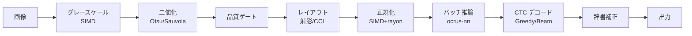

# アーキテクチャ

### クレート構成

| クレート | 役割 |
|----------|------|
| `ocrus-core` | データモデル、設定、エラー、EngineConfig API |
| `ocrus-preproc` | 画像前処理（SIMD グレースケール、Otsu/Sauvola 二値化、正規化） |
| `ocrus-layout` | レイアウト解析（射影、CCL、縦書き、品質ゲート、ルビ分離） |
| `ocrus-recognizer` | CTC 認識（Greedy + Beam Search、JIS 文字セット、辞書補正、カスケード） |
| `ocrus-nn` | 純 Rust 推論エンジン（.ocnn フォーマット、SIMD 演算、mmap モデルロード） |
| `ocrus-engine` | OCR パイプライン本体（前処理 → レイアウト → 推論 → デコード） |
| `ocrus-cli` | CLI エントリポイント（`ocrus-engine` の薄いラッパ） |
| `ocrus-python` | PyO3 バインディング（maturin で `ocrus` wheel をビルド） |
| `ocrus-dataset` | 訓練データ生成（フォントレンダリング、オーグメンテーション、フォントスタイルフィルタ） |
