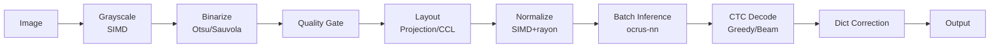

# Architecture

### Crates

| Crate | Role |
|-------|------|
| `ocrus-core` | Data models, config, errors, EngineConfig API |
| `ocrus-preproc` | Image preprocessing (SIMD grayscale, Otsu/Sauvola binarize, normalize) |
| `ocrus-layout` | Layout analysis (projection, CCL, vertical, quality gate, ruby separation) |
| `ocrus-recognizer` | CTC recognition (greedy + beam search, JIS charset, dict correction, cascade) |
| `ocrus-nn` | Pure Rust inference engine (.ocnn format, SIMD ops, mmap model loading) |
| `ocrus-engine` | OCR pipeline (preproc → layout → inference → decode) |
| `ocrus-cli` | CLI entry point (thin wrapper over `ocrus-engine`) |
| `ocrus-python` | PyO3 bindings, built as the `ocrus` wheel with maturin |
| `ocrus-dataset` | Training data generation (font rendering, augmentation, font style filtering) |
